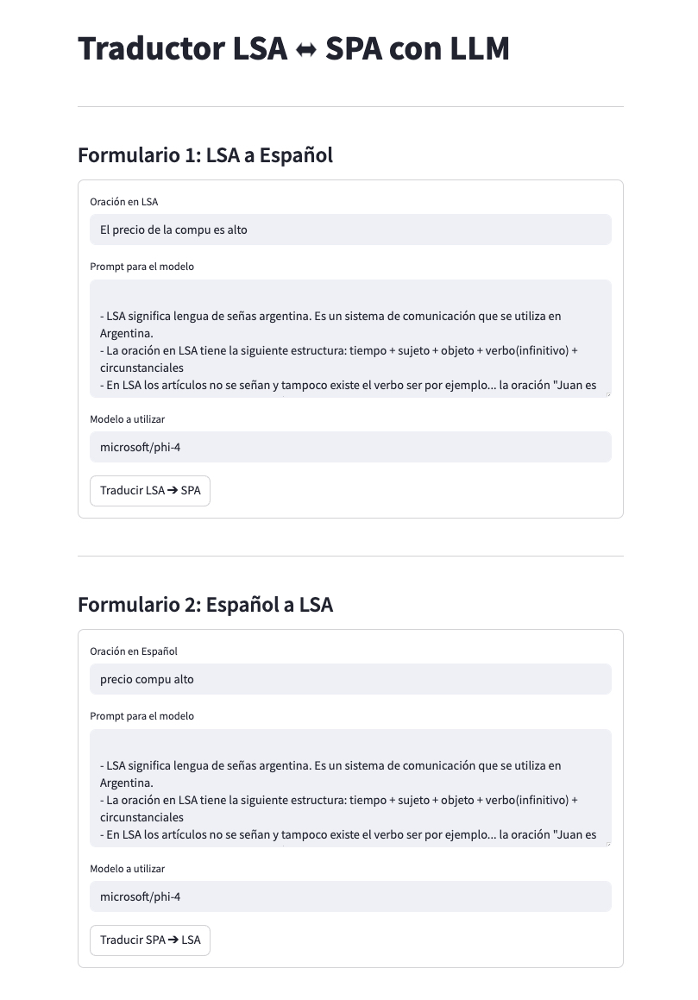
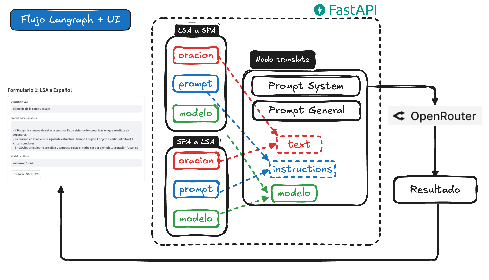

# Proyecto: Traductor LSA ⬌️ SPA

Este proyecto implementa un traductor automático entre Lengua de Señas Argentina (LSA) y Español, utilizando modelos de lenguaje grandes (LLMs) a través de LangChain, FastAPI y Streamlit.






### Prompt System
```
You are a helpful assistant that translates text from Argentinian Sign Language to spanish and spanish to Argentinian Sign Language. 
You will be given a text in one language and you need to translate it into another language.
Please provide the translation without any additional comments or explanations.
```

### General Prompt

```
Follow the instructions below to translate the text from one language to another:
Instrucctions: {instructions}
Texto to translate: {text}
Please provide the translation in the same format as the input text.
```

La variable <b>instructions</b> será el prompt con las indicaciónes de la traduccion y <b>text</b> será la oración a traducir. Ambos se ingresarán mediante el formulario de traducción.


### 
## Instalación de Docker

### Windows
1. Descargar e instalar Docker Desktop desde [Docker Desktop for Windows](https://www.docker.com/products/docker-desktop/).
2. Habilitar WSL 2 y reiniciar la PC si es necesario.

### Mac
1. Descargar e instalar Docker Desktop desde [Docker Desktop for Mac](https://www.docker.com/products/docker-desktop/).
2. Seguir las instrucciones del instalador.

### Linux
```bash
# Instalación rápida para distribuciones basadas en Debian/Ubuntu:
sudo apt update
sudo apt install docker.io docker-compose-plugin

# Habilitar Docker
sudo systemctl start docker
sudo systemctl enable docker
```

Verificar instalación:
```bash
docker --version
docker compose version
```


## Ejecución del proyecto

1. Clonar el repositorio.
2. Crear un archivo `.env` en las carpetas `backend/env` y `frontend/env`.
3. Dentro de cada `.env` definir la variable:

```bash
API_KEY=tu_api_key_aqui
```

> Nota: La API_KEY debe ser obtenida desde [openrouter.ai](https://openrouter.ai/) y es utilizada para autenticar el acceso a los modelos de lenguaje (LLMs) que permiten realizar las traducciones.

4. Ejecutar el proyecto con Docker Compose:

```bash
docker compose up --build
```

Esto levantará los servicios de backend (FastAPI) y frontend (Streamlit) automáticamente.


## Estructura del proyecto

```
.
├── backend
│   ├── app
│   │   ├── api           # Rutas de la API (FastAPI)
│   │   ├── db            # Lógica relacionada a base de datos (en progreso)
│   │   ├── flows         # Flujos de procesamiento de traducción LangGraph
│   │   ├── logs          # Logs de la aplicación
│   │   ├── main.py       # Punto de entrada FastAPI
│   │   ├── models        # Modelos de datos (en progreso)
│   │   ├── services      # Servicios de negocio (ej. invocación a LLM)
│   │   └── utils         # Utilidades como logger y carga de prompts
│   ├── dockerfile        # Dockerfile del backend
│   └── env               # Configuraciones y dependencias
├── docker-compose.yaml   # Orquestador de servicios Docker
├── frontend
│   ├── app
│   │   ├── config.py     # Configuraciones frontend
│   │   ├── env           # Configuraciones y dependencias
│   │   └── main.py       # Aplicación Streamlit
│   ├── dockerfile        # Dockerfile del frontend
├── lab
│   ├── notebooks         # Experimentación y desarrollo (Jupyter Notebooks)
```

**Nota:** Los archivos `.pyc` y `.env` no forman parte relevante de la estructura.


## Variables de entorno

Cada carpeta `env/` debe contener un archivo `.env` con la siguiente variable:

```bash
API_KEY=tu_api_key_de_modelo
```

> La `API_KEY` debe ser obtenida desde [openrouter.ai](https://openrouter.ai/), una plataforma que facilita el acceso a diversos modelos de lenguaje (LLMs) como GPT-4, Claude, entre otros.

Esta clave se usa para autenticar llamadas a la API del modelo de lenguaje.


## Tecnologías utilizadas

- **Frontend:** desarrollado con **Streamlit**, para interfaz rápida de carga de textos y visualización de resultados.
- **Backend:** construido con **FastAPI** para exponer servicios HTTP, integrando flujos de procesamiento de prompts mediante **LangChain** y **LangGraph**.


## Uso de la interfaz (UI)

En la interfaz de Streamlit encontrarás dos formularios:

1. **Oración:** campo donde debes ingresar el texto que deseas traducir.
2. **Prompt para el modelo:** campo donde debes cargar las instrucciones o reglas para la traducción.
3. **Modelo a utilizar:** campo donde debes especificar el nombre del modelo que deseas usar.

> Puedes obtener el nombre de los modelos disponibles visitando [openrouter.ai/models](https://openrouter.ai/models) y utilizando el botón de copiado para copiar el identificador exacto del modelo (por ejemplo: `meta-llama/llama-3.1-8b-instruct`, `deepseek/deepseek-r1-distill-llama-70b` o `microsoft/phi-4`).

Finalmente, debes presionar el botón correspondiente para enviar la solicitud y visualizar la traducción generada.


---

✨ Proyecto orientado a facilitar la traducción entre lenguaje de señas argentino (LSA) y español usando IA generativa.